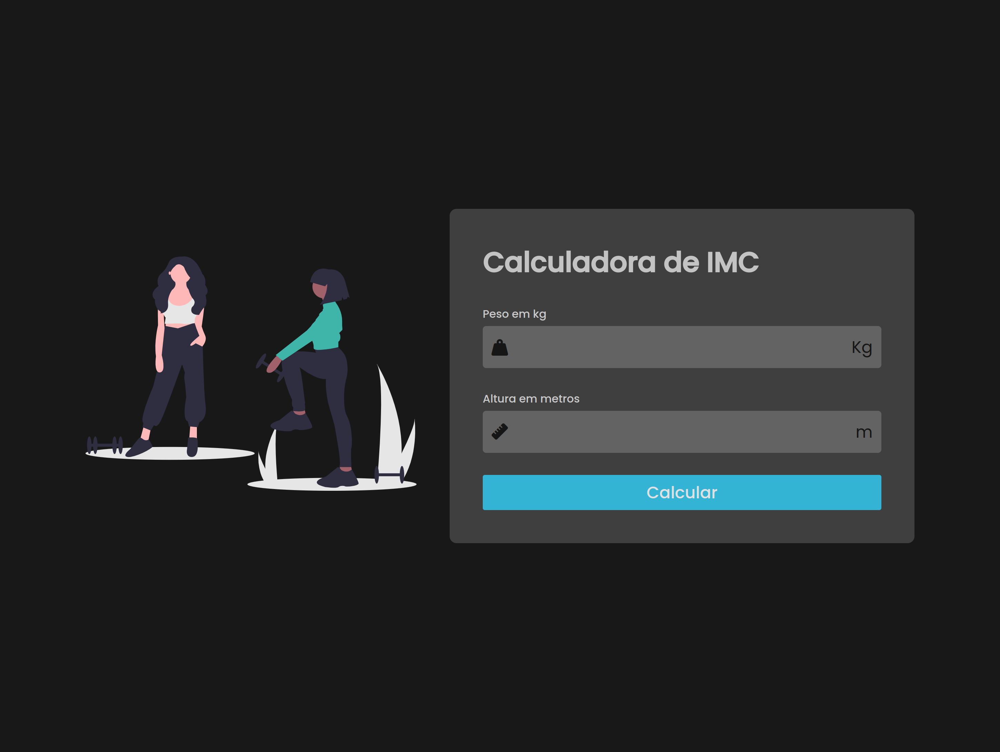
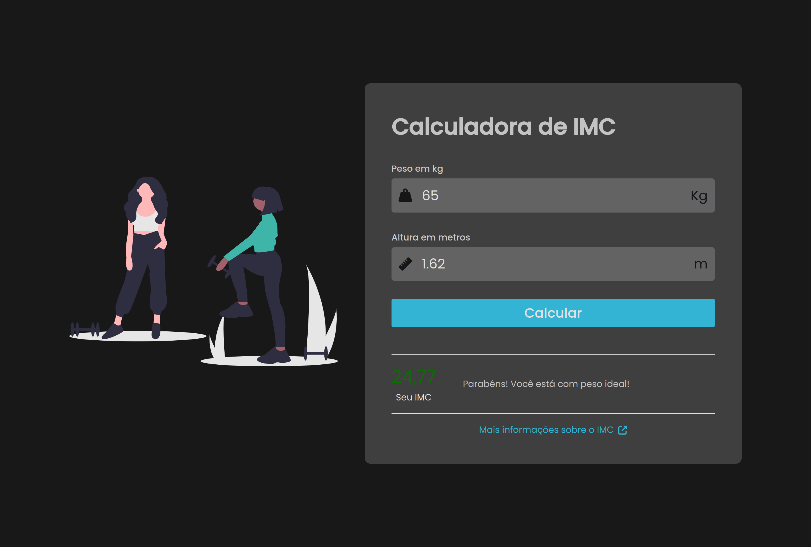

# Calculadora de IMC

Este é um projeto de uma calculadora de IMC (Índice de Massa Corporal), em que mostra o resultado do índice e a informação da faixa de classificação em que o usuário se encontra.  

## Índice

- [Visão geral](#visão-geral)
  - [O desafio](#o-desafio)
  - [Captura de tela](#captura-de-tela)
  - [Links](#links)
- [Meu processo](#meu-processo)
  - [Tecnologias utilizadas](#tecnologias-utilizadas)
  - [O que aprendi](#o-que-aprendi)
  - [Status do projeto](#status-do-projeto)
  - [Recursos úteis](#recursos-úteis)
- [Autora](#autora)
- [Licença](#licença)

## Visão geral

### O desafio

Os usuários devem ser capazes de:

- Fazer o cálculo do seu IMC
- Saber sua classificação 
- Ver os estados de foco para todos os elementos interativos na página

### Captura de tela




### Links

- URL da solução: [GitHub](https://github.com/adynaslima/Calculator-IMC.git)
- URL do site: [Deploy](https://calculadora-imc-snowy-kappa.vercel.app/)

## Meu processo

### Tecnologias utilizadas

- Marcação HTML5 semântica
- Propriedades personalizadas CSS
- Flexbox
- JavaScript

### O que aprendi

```js
    if (bmi < 18.5) {
        description = 'Cuidado! O seu peso está abaixo do ideal!';
    } else if (bmi >= 18.5 && bmi <= 25) {
        value.classList.remove('atencao');
        value.classList.add('normal');
        description = 'Parabéns! Você está com peso ideal!';
    //...
    }
```

### Status do projeto

Em construção...

### Recursos úteis

- [Vídeo - Larissa Kich](https://www.youtube.com/watch?v=UBYqkpsafyI&t=1314s) - Esse vídeo me ajudou a desenvolver a calculadora de IMC. Recomendo a todos que estão iniciando JavaScript e desejam fazer alguma aplicação mais básica. 

## Autora

- GitHub - [Adyna Lima](https://github.com/adynaslima)
- LinkedIn - [Adyna Lima](https://www.linkedin.com/in/adynalima/)

## Licença

Este projeto está licenciado nos termos da licença MIT.